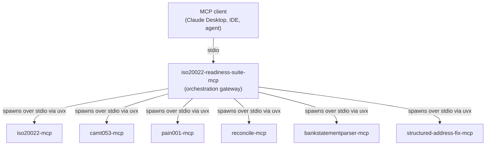

# iso20022-readiness-suite-mcp: The ISO 20022 Readiness & Testing Gateway

[![PyPI Version][pypi-badge]][07]
[![Python Versions][python-versions-badge]][07]
[![License][license-badge]][01]
[![Tests][tests-badge]][tests-url]
[![Quality][quality-badge]][quality-url]
[![OpenSSF Scorecard][scorecard-badge]][scorecard-url]
[![Documentation][docs-badge]][docs-url]

**A high-level orchestration [Model Context Protocol][mcp] server — the
White-Label ISO 20022 Readiness & Testing Gateway.** It is an MCP *server* to
your agent and an MCP *client* to the foundational servers of the
[ISO 20022 MCP Suite](#the-iso-20022-mcp-suite). It composes them into
readiness scoring, automated remediation, clearing-profile linting (CBPR+,
SEPA_Instant, FedNow, Generic), and bank-response simulation — one gateway an
agent can drive to answer "is this payment ready, and if not, fix it".

> **The November 2026 milestones.** As the major schemes (CBPR+, HVPS+, T2,
> FedNow) tighten their ISO 20022 requirements — structured postal addresses
> chief among them — a payment that was fine yesterday can be rejected
> tomorrow. `iso20022-readiness-suite-mcp` puts a single readiness gateway in
> front of your agent: `run_readiness_check` scores a payload against a
> clearing profile, `remediate_payload` proposes the compliant form, and
> `simulate_bank_response` mocks how a bank would answer. **v0.0.1**, stdio
> transport, 4 tools, Python 3.10+.

## Contents

- [Overview](#overview)
- [The ISO 20022 MCP Suite](#the-iso-20022-mcp-suite)
- [Install](#install)
- [Quick Start](#quick-start)
- [Tools](#tools)
- [Orchestration & the meta-client pattern](#orchestration--the-meta-client-pattern)
- [Open-core vs premium](#open-core-vs-premium)
- [When not to use iso20022-readiness-suite-mcp](#when-not-to-use-iso20022-readiness-suite-mcp)
- [Development](#development)
- [Security](#security)
- [Documentation](#documentation)
- [License](#license)
- [Contributing](#contributing)
- [Acknowledgements](#acknowledgements)

## Overview

The [Model Context Protocol][mcp] (MCP) is an open standard that lets AI agents
and assistants discover and call external tools in a uniform way.
**iso20022-readiness-suite-mcp** is the orchestration front door of the ISO
20022 MCP Suite: it presents four high-level tools to the outer agent, and
underneath it acts as an MCP *client* that spawns the foundational suite
servers over stdio and composes their results — the **meta-client pattern**.

The headline capability is the one-shot readiness workflow: hand it a raw ISO
20022 payload and a target clearing profile, and it detects the message type,
routes it to the correct base validator, lints it against the profile's
market-practice rules, and returns a single readiness score with the
findings — then, on request, remediates the payload and simulates how a bank
would respond.

Every tool returns typed, JSON-serialisable data; on any failure — a bad
input, an unparseable payload, a missing or erroring sub-server — it returns
an `{"error": ...}` payload rather than raising into the client transport.

- **Website:** <https://sebastienrousseau.github.io/iso20022-readiness-suite-mcp/>
- **Source code:** <https://github.com/sebastienrousseau/iso20022-readiness-suite-mcp>
- **Bug reports:** <https://github.com/sebastienrousseau/iso20022-readiness-suite-mcp/issues>



The gateway *is a server* to the client above it and *a client* to the six
foundational servers below it. `list_profiles` and `simulate_bank_response`
are fully local and need none of them; `run_readiness_check` and
`remediate_payload` reach the sub-servers and therefore require them to be
installed and resolvable (see
[Orchestration & the meta-client pattern](#orchestration--the-meta-client-pattern)).

## The ISO 20022 MCP Suite

`iso20022-readiness-suite-mcp` is the **orchestration gateway** that sits on
top of a set of coordinated, vendor-neutral MCP servers for the ISO 20022
migration. Dependency ranges are kept aligned across the suite, so the servers
co-install cleanly in a single Python environment: install the foundational
servers you need, then let this gateway compose them.

| Server | Scope | Install |
|------|------|------|
| [`iso20022-mcp`](https://github.com/sebastienrousseau/iso20022-mcp) | Unified gateway meta-tools (`search` / `describe` / `validate` / `generate` / `parse`) across the ISO 20022 message catalogue | `pip install iso20022-mcp` |
| [`camt053-mcp`](https://github.com/sebastienrousseau/camt053-mcp) | ISO 20022 camt.05x bank statements: parse, validate, filter, reverse; MT94x migration; CBPR+ readiness | `pip install camt053-mcp` |
| [`pain001-mcp`](https://github.com/sebastienrousseau/pain001-mcp) | Generate & validate ISO 20022 pain.001 payment-initiation files (v03–v12, pain.008, SEPA) with rulebook checks | `pip install pain001-mcp` |
| [`reconcile-mcp`](https://github.com/sebastienrousseau/reconcile-mcp) | Reconcile ISO 20022 payments and statements; match initiations to their bank-side outcomes | `pip install reconcile-mcp` |
| [`bankstatementparser-mcp`](https://github.com/sebastienrousseau/bankstatementparser-mcp) | Parse bank statements (MT940/MT942 and camt) into structured, agent-friendly data | `pip install bankstatementparser-mcp` |
| [`structured-address-fix-mcp`](https://github.com/sebastienrousseau/structured-address-fix-mcp) | ISO 20022 postal-address classification, assessment, and remediation for the Nov 2026 structured-address cliff | `pip install structured-address-fix-mcp` |

Where each foundational server does one job well, **this gateway** composes
them: it detects and routes a payload to the right validator, lints it against
a clearing profile, scores its readiness, remediates it, and simulates the
bank's answer — all behind four agent tools.

## Install

**iso20022-readiness-suite-mcp** runs on macOS, Linux, and Windows and
requires **Python 3.10+** and **pip**. It pulls in the MCP SDK, `pydantic`,
and `defusedxml` automatically.

```sh
python -m pip install iso20022-readiness-suite-mcp
```

To exercise `run_readiness_check` and `remediate_payload` end to end, also
make the foundational servers resolvable — the gateway launches them with
`uvx`, so installing [`uv`](https://docs.astral.sh/uv/) is enough for a
zero-install spawn:

```sh
python -m pip install uv        # provides the `uvx` launcher
```

<details>
<summary>Using an isolated virtual environment (recommended)</summary>

```sh
python -m venv venv
source venv/bin/activate        # macOS/Linux
venv\Scripts\activate           # Windows
python -m pip install -U iso20022-readiness-suite-mcp
```
</details>

## Quick Start

For the 10-minute install → MCP client config → first conversation tutorial,
see [`docs/quickstart.md`](docs/quickstart.md).

Launch the server over stdio (the FastMCP default transport):

```sh
iso20022-readiness-suite-mcp
```

Register it with any MCP client (e.g. Claude Desktop) by adding it to the
client's configuration:

```json
{
  "mcpServers": {
    "iso20022-readiness-suite": { "command": "iso20022-readiness-suite-mcp" }
  }
}
```

The command speaks MCP on stdin/stdout — it is meant to be launched by an MCP
client, not used interactively. The agent can then call the tools below.

You can also invoke the tools in-process — without a transport — straight
through the FastMCP instance. This mirrors what an agent receives over stdio.
The two local tools (`list_profiles`, `simulate_bank_response`) need no
sub-servers:

```python
import asyncio

from iso20022_readiness_suite_mcp import server


async def main() -> None:
    async def call(name, args):
        result = await server.server.call_tool(name, args)
        content = result[0] if isinstance(result, tuple) else result
        return content[0].text if content else ""

    # Which clearing profiles can I target? (fully local)
    print(await call("list_profiles", {}))
    # -> [{"profile_id": "CBPR+", ...}, {"profile_id": "SEPA_Instant", ...}, ...]

    # Mock how a bank would answer an initiation. (fully local)
    pacs008 = '<Document><CdtTrfTxInf><Amt Ccy="EUR">10</Amt></CdtTrfTxInf></Document>'
    print(await call("simulate_bank_response",
                     {"inbound_payload": pacs008, "desired_behavior": "ACCP"}))
    # -> {"status": "ACCP", "generated_response_type": "pacs.002.001.10", ...}


asyncio.run(main())
```

## Tools

All tools return JSON-serialisable data; on a domain, validation, or
sub-server error they return an `{"error": ...}` payload rather than raising.

- `list_profiles` — List the available clearing profiles (CBPR+, SEPA_Instant, FedNow, Generic) with their market practice and rules. Fully local; no sub-servers needed.
- `run_readiness_check` — Detect, structurally validate, profile-lint, and score an ISO 20022 payload's readiness against a target clearing profile. Reaches the foundational sub-servers.
- `remediate_payload` — Apply automated remediation (e.g. the Nov 2026 structured-address fixes) driven by a clearing profile, delegating to `structured-address-fix-mcp`. Reaches the foundational sub-servers.
- `simulate_bank_response` — Emit a pacs.002 status report mocking a bank's ACCP / RJCT / PDNG response to an inbound initiation (a reason code is required for RJCT). Fully local; no sub-servers needed.

> **Reachability.** `run_readiness_check` and `remediate_payload` spawn the
> underlying servers over stdio via `uvx`, so those servers must be
> installed / resolvable for the two tools to succeed. `list_profiles` and
> `simulate_bank_response` compute purely locally and always work standalone.

## Orchestration & the meta-client pattern

The gateway implements the "server that is also a client" half of the
orchestration: an orchestrator depends only on a `SubServerInvoker` protocol,
and the production `StdioSubServerInvoker` spins up an underlying server over
stdio, calls one tool, and tears the session down. Every failure — a missing
server, a spawn error, a tool error — is returned as data (a typed
`ToolOutcome`), never raised across the caller boundary.

By default each foundational server is launched with a zero-install `uvx`
command:

| Sub-server | Default launch command |
|---|---|
| `iso20022-mcp` | `uvx iso20022-mcp` |
| `camt053-mcp` | `uvx camt053-mcp` |
| `pain001-mcp` | `uvx pain001-mcp` |
| `reconcile-mcp` | `uvx reconcile-mcp` |
| `bankstatementparser-mcp` | `uvx bankstatementparser-mcp` |
| `structured-address-fix-mcp` | `uvx structured-address-fix-mcp` |

The command map is overridable per deployment, so you can point the gateway at
locally installed console scripts, a pinned virtualenv, or a remote-launched
process instead of `uvx`. See [`docs/orchestration.md`](docs/orchestration.md)
for the full pattern and how to point it at local or remote sub-servers.

## Open-core vs premium

The gateway is **open core**: the baseline validation workflows and the
generic scheme profiles are open source and always available. Higher-tier,
institution-specific capabilities are commercial add-ons that plug into the
same profile-engine and orchestration seams (the profile engine already
exposes a `register()` hook for runtime-loaded rule packs).

| Capability | Tier |
|---|---|
| Basic Validation Workflows | **Open Source** |
| Generic Scheme Profiles (CBPR+, SEPA_Instant, FedNow, Generic) | **Open Source** |
| Advanced Proprietary Rule Packs | **Paid** |
| White-Label Portals | **Paid** |
| Stateful Persistence Logs | **Paid** |

The paid tiers are on the [roadmap](ROADMAP.md) (premium rule-pack entitlement
gating, plus the sister `iso20022-bank-profile-mcp` and
`iso20022-evidence-pack-mcp` servers), not in this release. Nothing in the
open-source tier is time-limited or feature-gated.

## When not to use iso20022-readiness-suite-mcp

- **You have no MCP client.** This server only makes sense paired with an
  MCP-aware host (Claude Desktop, the IDE plugins, an agent framework).
- **You only need one message operation.** If you just want to validate a
  pain.001 or parse a camt.053, call the relevant foundational server
  directly — the gateway's value is *composing* them.
- **You need `run_readiness_check` / `remediate_payload` without the
  sub-servers.** Those two tools require the foundational servers to be
  resolvable (via `uvx` or an overridden command map). If you cannot install
  them, you are limited to `list_profiles` and `simulate_bank_response`.
- **You need a long-lived network service.** v0.0.1 speaks **stdio only** —
  one process per operator, launched by the client, no network surface. An
  HTTP/OAuth transport for shared, multi-tenant deployments is on the
  [roadmap](ROADMAP.md), not in this release.
- **You need streaming responses.** Tool calls return whole values, not
  streams.

## Development

**iso20022-readiness-suite-mcp** uses [Poetry](https://python-poetry.org/) and
[mise](https://mise.jdx.dev/).

```bash
git clone https://github.com/sebastienrousseau/iso20022-readiness-suite-mcp.git && cd iso20022-readiness-suite-mcp
mise install
poetry install
poetry shell
```

> **Note:** the test suite injects a fake sub-server invoker, so you do **not**
> need the foundational servers installed to run the tests — only to exercise
> `run_readiness_check` / `remediate_payload` against real servers. See
> [`CONTRIBUTING.md`](CONTRIBUTING.md).

A `Makefile` orchestrates the quality gates (kept in lockstep with CI):

```bash
make check        # all gates (REQUIRED before commit): lint + type-check + test
make test         # pytest (100% line + branch coverage)
make lint         # ruff + black
make type-check   # mypy --strict
make security     # bandit
```

## Security

`iso20022-readiness-suite-mcp` returns errors as data — every tool catches the
documented domain, validation, and value errors (and every sub-server failure)
and returns an `{"error": ...}` envelope; it never propagates raw exceptions
to the MCP client. XML payloads reached through the clearing-profile engine
are parsed with `defusedxml` only (no XXE / billion-laughs). Reporting
practice, supported versions, the meta-client attack surface, and the full
supply-chain posture (SLSA L3 provenance, PEP 740 attestations, SBOMs, and the
NIST SP 800-218 SSDF practice mapping) are documented in
[`SECURITY.md`](SECURITY.md). Vulnerabilities go via GitHub Private
Vulnerability Reporting, not public issues.

## Documentation

- [`README.md`](README.md) — this file
- [`CHANGELOG.md`](CHANGELOG.md) — release notes
- [`SECURITY.md`](SECURITY.md) — disclosure + supported versions
- [`SUPPORT.md`](SUPPORT.md) — how to get help
- [`ROADMAP.md`](ROADMAP.md) — what's next (sister servers, HTTP/OAuth transport, premium rule-pack entitlement)
- [`MAINTAINERS.md`](MAINTAINERS.md) — who can merge
- [`docs/quickstart.md`](docs/quickstart.md) — 10-minute install → first conversation
- [`docs/orchestration.md`](docs/orchestration.md) — the meta-client pattern and pointing the gateway at local/remote sub-servers
- [`docs/profiles.md`](docs/profiles.md) — the clearing profiles and how premium rule packs plug in
- [`glama.json`](glama.json) — Glama directory manifest

---

## MCP Registry

`mcp-name: io.github.sebastienrousseau/iso20022-readiness-suite-mcp`

---

## License

Licensed under the [Apache License, Version 2.0][01]. Any contribution submitted
for inclusion shall be licensed as above, without additional terms.

## Contributing

Contributions are welcome — see the [contributing instructions][04]. Thanks to
all [contributors][05].

## Acknowledgements

Built on the foundational servers of the ISO 20022 MCP Suite and the
[Model Context Protocol][mcp] Python SDK.

[01]: https://opensource.org/license/apache-2-0/
[04]: https://github.com/sebastienrousseau/iso20022-readiness-suite-mcp/blob/main/CONTRIBUTING.md
[05]: https://github.com/sebastienrousseau/iso20022-readiness-suite-mcp/graphs/contributors
[07]: https://pypi.org/project/iso20022-readiness-suite-mcp/
[mcp]: https://modelcontextprotocol.io
[docs-badge]: https://img.shields.io/badge/Docs-iso20022--readiness--suite-blue?style=for-the-badge
[docs-url]: https://sebastienrousseau.github.io/iso20022-readiness-suite-mcp/
[license-badge]: https://img.shields.io/pypi/l/iso20022-readiness-suite-mcp?style=for-the-badge
[pypi-badge]: https://img.shields.io/pypi/v/iso20022-readiness-suite-mcp?style=for-the-badge
[python-versions-badge]: https://img.shields.io/pypi/pyversions/iso20022-readiness-suite-mcp.svg?style=for-the-badge
[quality-badge]: https://img.shields.io/github/actions/workflow/status/sebastienrousseau/iso20022-readiness-suite-mcp/ci.yml?branch=main&label=Quality&style=for-the-badge
[quality-url]: https://github.com/sebastienrousseau/iso20022-readiness-suite-mcp/actions/workflows/ci.yml
[scorecard-badge]: https://api.scorecard.dev/projects/github.com/sebastienrousseau/iso20022-readiness-suite-mcp/badge?style=for-the-badge
[scorecard-url]: https://scorecard.dev/viewer/?uri=github.com/sebastienrousseau/iso20022-readiness-suite-mcp
[tests-badge]: https://img.shields.io/github/actions/workflow/status/sebastienrousseau/iso20022-readiness-suite-mcp/ci.yml?branch=main&label=Tests&style=for-the-badge
[tests-url]: https://github.com/sebastienrousseau/iso20022-readiness-suite-mcp/actions/workflows/ci.yml
